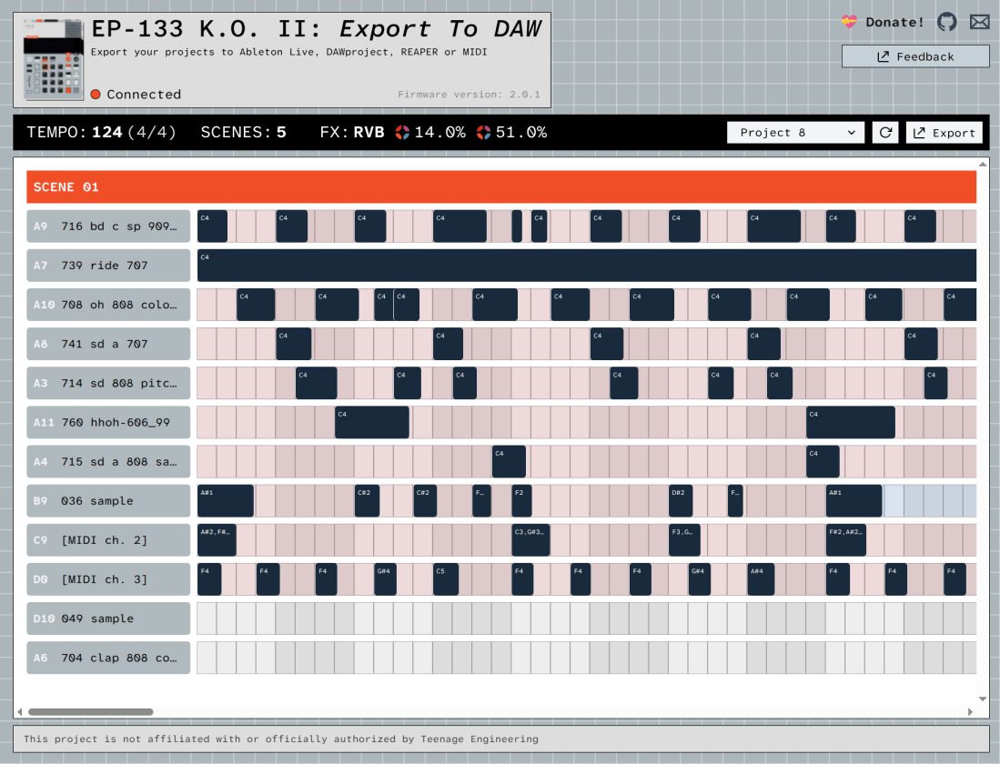
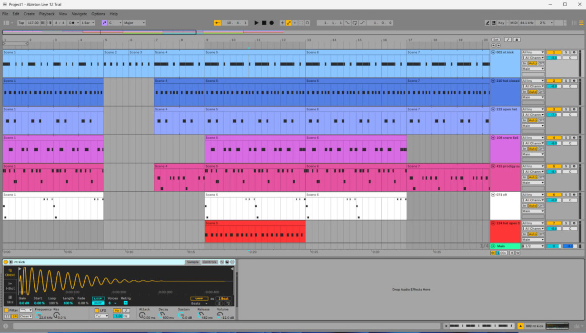
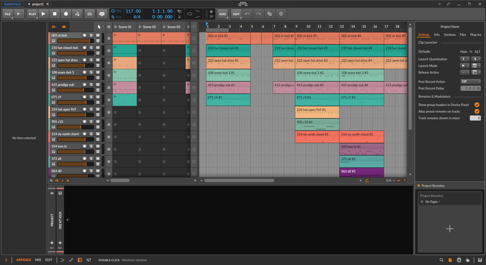
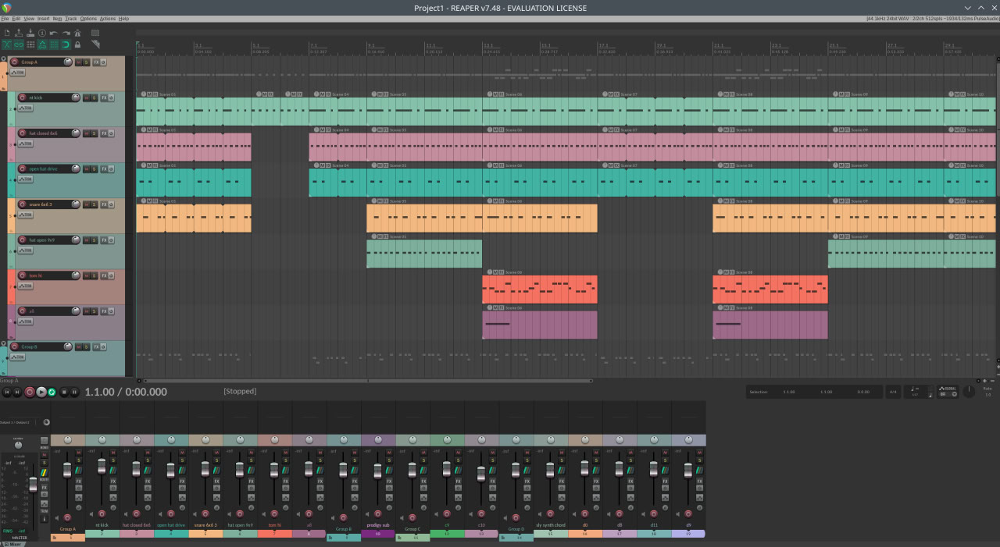

**This project is not affiliated with or officially authorized by Teenage Engineering**

# EP-133: Export To DAW

This tool allows you to export your EP-133/EP-1320/EP-40 project into a DAW (Digital Audio Workstation).

Try it out on https://ep133-to-daw.cc/

Check the project blog here: https://ko-fi.com/phones24

  
  
  

## Features

- Requires only browser with WebMIDI support
- Works offline (Progressive Web App)
- Offline mode: Drop a `.pak` backup file to browse and export projects without connecting your device
- Export projects directly from EP-133/EP-1320/EP-40 to:
  - Ableton Live 11+ (project with samples)
  - DAWproject (project + archived samples)
  - REAPER (project with samples)
  - MIDI (MIDI file + archived samples)
- Ableton Live:
  - Minimum version: 11.3.35
  - Supports all sampler features: envelope, trimming points, stretching, playback modes
  - Export as arrangements or session clips
  - Fader params
  - FX send/return
  - Track grouping: 4 groups, same as on the device
  - Any group can be exported as a Drum Rack track
- DAWproject (universal DAW format created by Bitwig):
  - Export as arrangements with clips
  - Includes archived samples
  - Track grouping: 4 groups, same as on the device
- REAPER
  - Export arrangements
  - Basic sampler instrument has added to each track
  - Includes samples
  - Support track grouping
- MIDI:
  - Includes archived samples
  - Any group can be exported as a Drum Rack track

## Latest news

- [27/12/2025] Load projects from backup
- [13/11/2025] EP-40 Riddim is partailly supported + themes
- [27/10/2025] ABLETON: support fader params (but without automation for now)
- [16/10/2025] Added REAPER's sampler (just envs, root note, volume)
- [13/10/2025] Added time signature support
- [10/10/2025] REAPER support
- [08/10/2025] Rewrote TE sysex library
- [26/09/2025] Group A merging added for DAWProject and MIDI transformers
- [23/09/2025] ABLETON: FX support! The return track will be added with attached effect and each track(or group) will be sending to this return track
- [19/09/2025] Added feedback functionality with ability to attach your project for research
- [17/09/2025] ABLETON: Export tracks from group A into Drum Rack (with choke group!)
- [16/09/2025] ABLETON: Added play modes support: KEY and ONE
- [16/09/2025] ABLETON: Added sample stretching (both BPM and BAR modes are supported)
- [12/09/2025] ABLETON: Added the ability to group tracks (4 groups, same as EP) + bugfixes
- [09/09/2025] ABLETON: Minumum supported version is now 11.3.35
- [09/09/2025] App is now working offline (PWA mode)
- [08/09/2025] Added Ableton 12 support + more note duration bugs are fixed
- [03/09/2025] Fixed several bugs, including issues with velocities and note durations
- [29/08/2025] Added MIDI export

## Motivation

If you’ve been producing with the EP-133 (or EP-1320), you already know the frustration: there’s no clear way to export your projects directly into a DAW.
The official EP Sample Tool only lets you manage samples and backups. That’s it.

Sure, you could record MIDI notes or capture audio track by track, but it’s slow, tedious, and not fun.

At some point, I started digging through the backup files created by Sample Tool and realized there is the way to get data/notes/settings/etc. The EP-133 actually has its own internal filesystem. Everything - projects, notes, settings - is stored there, and the backup tool simply copies these files into an archive when backing up.

So I started digging through the file format and trying to reuse the logic from the Sample Tool, since Teenage Engineering doesn’t publish its source code.
I spent a lot of time de-obfuscating it (AI helps a lot there), reverse-engineering the files, and eventually building a working library (check src/ep133 folder).
Then building the web application was easy.

## Donation

If you find this project useful, please consider supporting its development with a donation!

You can find the donation button on the project website, in the top-right corner.
